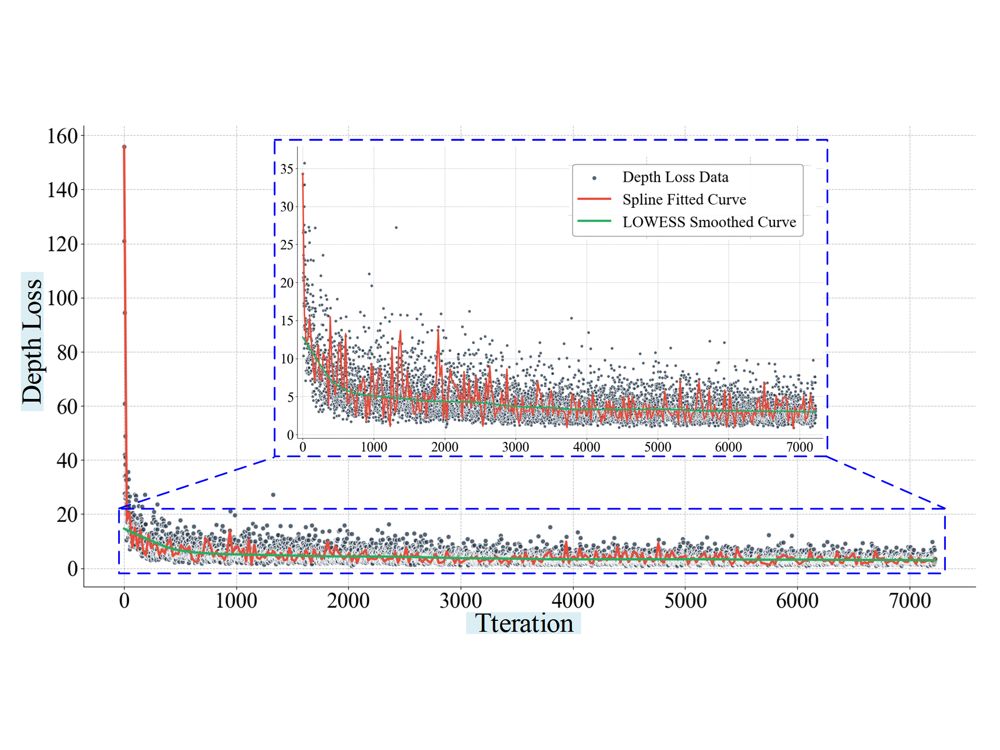

# Experimental Results of MT-MVSNet on Public Datasets

This section presents the experimental results of **MT-MVSNet** evaluated on the public datasets **DTU** and **Tanks & Temples**. The network achieved an overall accuracy of **0.312 mm** on the DTU benchmark and an F-score of **54.18%** (BlendedMVS Unfine-Tuned) on the Tanks & Temples dataset. The results are provided as unique point cloud files, each representing distinct, non-replicable outputs. The evaluation metrics for the DTU dataset were computed using MATLAB code, following the procedures outlined in the **MVSNet** method (available at: [MVSNet GitHub](https://github.com/YoYo000/MVSNet)).

To further demonstrate the convergence of our model during training, we have also plotted the training loss curve for the DTU dataset. The following figure shows the trend of Depth Loss over iterations, where we observe a rapid decline in the early stages followed by a gradual decrease, confirming the model's convergence without overfitting or underfitting.

  
*Figure X: Training loss curve of MT-MVSNet on the DTU dataset.*

The methodology and detailed results are described comprehensively in the paper **“MT-MVSNet: A Lightweight and Highly Accurate Convolutional Neural Network Based on Mobile Transformer for 3D Reconstruction of Orchard Fruit Tree Branches”**.

Due to the substantial storage requirements of the point cloud files, the test results on the DTU dataset have been stored on Google Drive. In contrast, the results for the Tanks & Temples dataset are published and accessible via the official Tanks & Temples evaluation platform. The details are provided as follows:

1. **Test Results on DTU Dataset**: The results can be downloaded from Google Drive at the following link: [Google Drive Link](https://drive.google.com/drive/folders/1OlcHlkrwVOSA5i2IAVQN8rA7VqKt7ecx?dmr=1&ec=wgc-drive-hero-goto).

2. **Test Results on Tanks and Temples Dataset**: This includes both fine-tuned and non-fine-tuned results from the BlendedMVS model. The corresponding test results can be accessed via the following links:
   - [BlendedMVS Fine-Tuned Results](https://www.tanksandtemples.org/details/7425/)
   - [BlendedMVS Unfine-Tuned Results](https://www.tanksandtemples.org/details/7397/).

It should be noted that the codebase for MT-MVSNet, along with the pre-trained models and the complete evaluation pipeline, will be made publicly accessible after the publication of this paper. We encourage readers to visit this section for future updates and additional resources.

